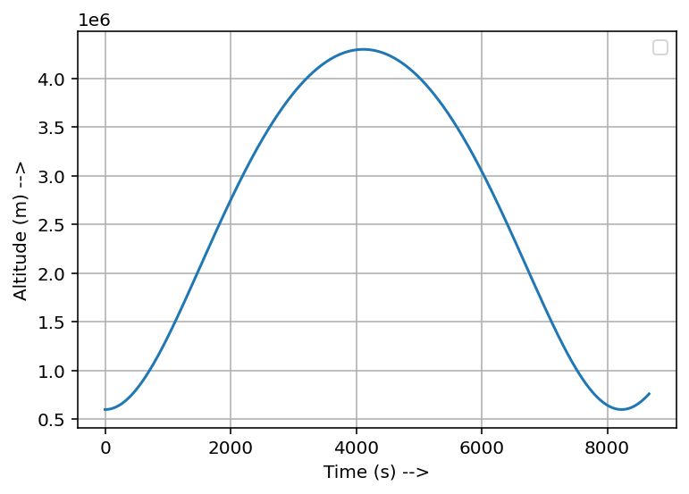

# Orbital-Mechanics

This is a collection of my work in trying to write algorithms for simulating orbital motion and other problems in astrodynamics.
These mostly are done in MATLAB, occasionally some in Python.

## Python

### PROJECTILE MOTION (Simple Gravity Model):

  &nbsp;&nbsp;  

### PROJECTILE MOTION (Newtonian Gravity Model):
  &nbsp;&nbsp;  

### Orbit Simulation (2D)
  
  &nbsp;&nbsp;  

  &nbsp;&nbsp;  

